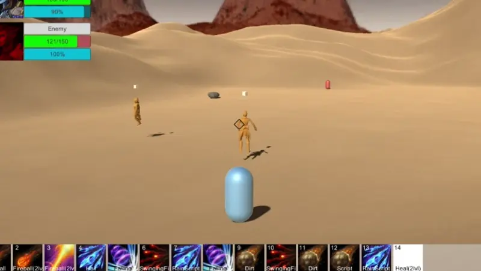
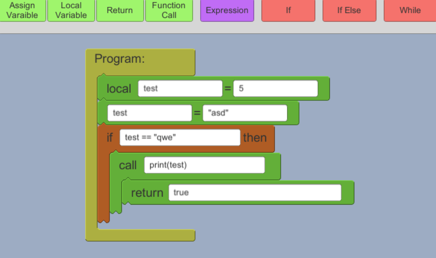

# Magic

Proof of concept project game which allows players to program their own spell logic. With flexibility, game-like constraints and "realistic" physics in mind it aims to create a competitive environment where players can show off and put their spell making skills to the test.

A secondary aim of the project is to be accessible and educational. This is done by allowing the players to use Lua as a programing language, with its simple syntax and straightforward structures. It's also available to non-programmers with an interface similar to that of the Scratch programming language. 

## Energy

Energy is the main focus of each spell. It is an abstract measure and is used up by any action done for a spell. It may be physically manifested, used to push stuff around or apply buffs. 

## Flexibility

The logic allows the player's avatar to do all sorts of actions with their available energy which account for most of the things you'd need to implement your favorite spell from your favorite game. These include buff/debuff effects, summoning portals, spawning creatures or consumables, and operations on energy manifestations like adding/removing energy, changing the element (fire, water, ect), changing the shape (sphere, spike/cone), applying forces and more. 

## Constraints

The game imposes some constraints in the players to avoid making them overpowered. These are things like allowing the player to only "focus" on just a few manifestations, which limits their ability to overwhelm the enemy. Also with limited energy, players are prohibited from manifesting or manipulating powers beyond their experience level. 

## Physics

The game's physics, although fantastical, are still based on realistic physics principles, which lays down a level playing field and makes the learning curve much flatter. Theae are simulations of conservation of energy, pressure, temperature, element interactions, speed limits (a limitation of the physics engine, thus much lower than the speed of light) and more. 

## Example spell

An example can be seen in the GIF attached above - a spell named "Hail" which bombards the enemy with ice spikes.
It works by manifesting energy above the target with a preset shape (cone) and element (ice).
This manifestation is automatically added to the "focused" manifestations, of which there cannot be too many.
It is then oriented towards the target and a force is applied sending it in the correct direction.
Since the spike will no longer be manipulated, it is then defocused and the next one is spawned.

The spell can expanded to be parameterized to use different shapes, elements, force sizes and number of attacks, to achieve different results, or provide different "levels" of the same spell.
It could also be expanded, if the player is capable of focusing on more than one manifestation at a time, such that each spike tries to track the target as they try to escape.
